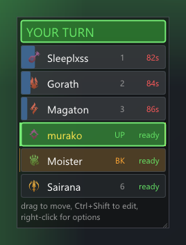

# Rezz Order

A Guild Wars 2 addon for WvW squads that agree on a revive order. It watches everyone's instant revive
skills and shows whose turn it is, so two people don't burn a Battle Standard and a Signet of Mercy on the
same downed commander.



## Install

1. Install [Nexus](https://raidcore.gg/Nexus), and [ArcDPS](https://www.deltaconnected.com/arcdps/) with the
   **ArcDPS Integration** addon from the Nexus addon library. That integration is how combat events reach
   this addon — without it nothing is tracked.
2. Recommended: [Unofficial Extras](https://github.com/Krappa322/arcdps_unofficial_extras_releases). It
   gives squad roles, instant notice when somebody leaves, and the squad chat messages that order sharing
   reads.
3. Put `RezzOrder.dll` in `<Guild Wars 2>\addons\`.
4. Start the game. About 20 seconds in you get one message saying everything was found — or which piece is
   missing.

## Using it

### Set an order

Press **Ctrl+Shift+O** for the order editor. The left column is your squad, the right is the order: click
`+` to add someone, drag a row to move it. Only professions with an instant revive show up unless you tick
*all professions*.


No editor needed for small changes: **right-click the turn window** to add a player, remove one, give
somebody a nickname, or load a saved order.

### Read the turn window

- `UP` is whose turn it is, `BK` is the backup — the next person ready after them.
- Bright green means **you**. A quieter green means somebody else is up.
- A recharging player shows the seconds left in red and a bar filling up: their turn comes round again.
- A downed or dead player fades to grey — they are simply skipped.
- `ready?` means that player joined too recently for the addon to know their skill is really up.
- `?` next to a number means they have been out of range for the whole fight, so their state may be stale.

### Make it yours

Right-click the window → **style**:

- Four layouts: a compact list, big bars, a focus card, or a horizontal strip along a screen edge.
- Recharge as a bar, in seconds, or both.
- Drag the **corner grip** to size the whole window; drag the window to move it.
- **Ctrl+Shift+L** locks it: it stops moving and clicks pass through to the game. Hold **Ctrl+Shift** to
  edit it anyway.


### Know when it is your turn

In the Nexus options page, under *When the turn reaches you*, each of these can be set for "your turn" and
for "backup" on its own:

- a **banner** across the top of the screen,
- a **sound** — six to choose from, each with a play button, plus your own WAV file,
- a **flash** along the edges of the screen, in a colour you pick.

All of them only fire on WvW maps.

### Share the order with the squad

Addons are not allowed to write in chat, so it takes one paste:

1. **Ctrl+Shift+K** (or right-click → *Copy order for squad chat*) puts a line on your clipboard:
   `!rezz Gorath > murako > Sairana`
2. Paste it into squad chat.

Everyone else running the addon picks it up. The commander's and lieutenants' orders are applied straight
away; anybody else's waits in a window that shows the order and where it would put you. Somebody who joins
late can type `!rezz?` to ask, and the person whose order it is gets a one-click *Add them and copy*.

### Try it without a squad

Nexus options → **Demo squad**. A made-up squad fights on a loop so you can place the window, pick a layout
and tune the sound and flash. It never touches your real order.

## Building it

Visual Studio with the C++ desktop workload, CMake and Ninja.

```
git clone --recursive https://github.com/qq1ng/rezz_order
cd rezz_order
.\scripts\build.ps1           # build\release\RezzOrder.dll
.\scripts\build.ps1 -Deploy   # ... and copy it into the addons folder
.\scripts\check.ps1           # build + unit tests + UI renders
```

## How it works, and how it is tested

Squad combat events reach addons about **2.6 seconds late** — that is ArcDPS by design, not a bug here.
Cooldowns are therefore measured from the time the cast really happened, not from when the event arrived.
A revive counts as spent when ArcDPS reports a full cast, or when the cast ran at least its base cast time;
that rule was checked against roughly 430 recorded casts (`docs/phase0-results.md`).

Two things run without starting the game:

- `rezz_tracker_tests.exe` — the tracker, the live session, order sharing, settings and demo mode as plain
  unit tests.
- `rezz_uishot.exe` — renders the addon's **real** UI code offscreen with Direct3D and saves a PNG per
  situation, then checks each one: the right number of rows, a banner naming whoever has to act, a window
  that fits on screen. `docs/shots/report.txt` is a text dump of every layout, so a change shows up in a
  diff instead of having to be spotted in a picture.

`tools/replay.cpp` replays recorded ArcDPS logs through the same session code.

`docs/roadmap.md` says where this is going; `docs/phase3-layouts-and-sharing.md` describes the current
state in detail.

## Licence

Not chosen yet.
