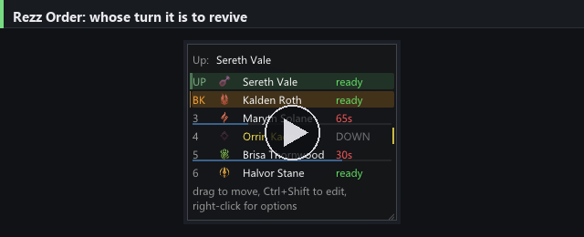

# Rezz Order

A Guild Wars 2 addon for WvW squads that agree on a revive order. It watches everyone's instant revive
skills and shows whose turn it is, so two people don't burn a Battle Standard and a Signet of Mercy on the
same downed commander.

[](docs/images/banner.mp4)

*(click for a 16 second tour)*

## Install

1. **Nexus.** Get it from [raidcore.gg/Nexus](https://raidcore.gg/Nexus) and install it into your Guild Wars
   2 folder. Nexus is the addon loader everything else sits on.
2. **ArcDPS, plus the ArcDPS Integration addon.** ArcDPS comes from
   [deltaconnected.com/arcdps](https://www.deltaconnected.com/arcdps/). *ArcDPS Integration* is a separate
   addon you install from the Nexus addon library (Nexus menu, Addons, search for it). It is what passes
   ArcDPS combat events on to other addons, and without it this addon sees nothing at all.
3. **Unofficial Extras** (optional but recommended), from
   [its releases page](https://github.com/Krappa322/arcdps_unofficial_extras_releases). It adds squad roles,
   instant notice when somebody leaves the squad, and the squad chat messages that order sharing reads.
4. Put `RezzOrder.dll` into `<Guild Wars 2>\addons\`.
5. Start the game. About 20 seconds in you get one message telling you everything was found, or naming what
   is missing. That message only appears once per version.

## Using it

### Build an order

**Right-click the turn window.** That menu is all you need most nights: *Add me*, *Add player* to pick
somebody out of the squad, *Remove player*, a nickname for anyone whose name you never remember, and your
saved orders. Right-clicking a row in the list acts on that player.

For setting a whole squad up at once, press **Ctrl+Shift+O** for the order editor. The left column is the
squad, the right column is the order: `+` adds someone, dragging a row moves it. Only professions with an
instant revive are listed unless you tick *all professions*.


### Read the turn window

- `UP` is whose turn it is. `BK` is the backup, meaning the next person ready after them.
- Bright green means **you**. A quieter green means somebody else is up.
- A recharging player shows the seconds left in red, with a bar filling up: their turn comes round again.
- A downed or dead player fades to grey. They are skipped.
- `ready?` means that player joined too recently for the addon to know their skill is really up.
- `?` next to a number means nothing has been heard from them for the whole fight, so they are out of range
  and their state may be stale.
- A `*` after a name marks a precast player. See below.

### Customizable

Right-click the window and pick **style**:

- Five layouts: a compact list, big bars, a focus card, a horizontal strip for a screen edge, or **next up**,
  which shows the player who is up on a card, the backup directly under it, and as many of the following
  players as *max displayed* allows. That list rolls with the turn, so the top of it is always who to watch.
- Recharge as a bar, in seconds, or both.
- Drag the **corner grip** to size the whole window. Drag the window itself to move it.
- **Ctrl+Shift+L** locks it: it stops moving and clicks pass through to the game. Hold **Ctrl+Shift** to
  edit it anyway.


### Know when it is your turn

In the Nexus options page, under *When the turn reaches you*, each of these can be set for "your turn" and
for "backup" separately:

- a **banner** across the top of the screen,
- a **sound**, six to choose from with a play button on each, or your own WAV file,
- a **flash** along the edges of the screen, in a colour you pick.

All three only fire on WvW maps, and a turn that bounces back to you within ten seconds is announced once.

### Share the order with the squad

Addons are not allowed to write in chat, so sharing takes one paste:

1. **Ctrl+Shift+K**, or right-click the window and pick *Copy order for squad chat*. Your clipboard now
   holds a line like `!rezzorder Kalden > Orrin* > Halvor`.
2. Paste it into squad chat.

Everyone else running the addon reads it from there. An order from the commander or a lieutenant is applied
straight away. Anybody else's waits in a window showing the order and where it would put you, with *Use this
order* and *Ignore*.

### Ask for the order

Type **`?rezzorder`** in squad chat. This is for joining a squad that already agreed an order: instead of
asking on voice, the question goes to every client running the addon.

Only one person is asked to answer it, the one whose order it is, so a squad of ten does not get ten popups.
Their window names you and offers *Copy it for squad chat*. If you are not in the order yet, which is the
usual reason for asking, the first button instead reads *Add you and copy*, which puts you at the end and
copies the line in one click.

### Precast players

A `*` after a name marks a **precast** player: somebody who spends their revive when they see a fight going
badly and calls it on voice, rather than waiting for their turn. Right-click a player and pick *May cast
early* to mark them.

The mark shows in the turn window and travels in the shared line, so the whole squad sees who is playing
that way. Casting early costs them nothing in the rotation: only the player whose turn it actually was moves
the order on, so everybody else keeps their place.

### Try it without a squad

Nexus options, then **Demo squad**. A made-up squad fights on a loop so you can place the window, pick a
layout and tune the sound and flash. It never touches your real order, and it stops when you change
character or map.

## Building it

Visual Studio with the C++ desktop workload, CMake and Ninja.

```
git clone --recursive https://github.com/qq1ng/rezzOrder
cd rezzOrder
.\scripts\build.ps1           # build\release\RezzOrder.dll
.\scripts\build.ps1 -Deploy   # ... and copy it into the addons folder
.\scripts\check.ps1           # build, unit tests, UI renders
```

## How it works, and how it is tested

Squad combat events reach addons about **2.6 seconds late**. That is ArcDPS by design, not a fault here, and
it is why cooldowns are measured from the time a cast really happened rather than from when the event
arrived. A revive counts as spent when ArcDPS reports a full cast, or when the cast ran for at least its
base cast time. That rule was checked against roughly 430 casts recorded in the field.

Two things run without starting the game:

- `rezz_tracker_tests.exe` covers the tracker, the live session, order sharing, settings and demo mode as
  plain unit tests.
- `rezz_uishot.exe` renders the addon's real UI code offscreen with Direct3D and saves a PNG per situation,
  then checks each one: the right number of rows, a banner naming whoever has to act, a window that fits on
  screen. `docs/shots/report.txt` is a text dump of every layout, so a change shows up in a diff instead of
  having to be spotted in a picture.

`tools/replay.cpp` replays recorded ArcDPS logs through the same session code.

Some source comments point at write-ups under `notes/`: the measurement results, phase plans and the
roadmap. Those are working notes rather than documentation, and they are not published with the repo.

## Licence

Not chosen yet.
